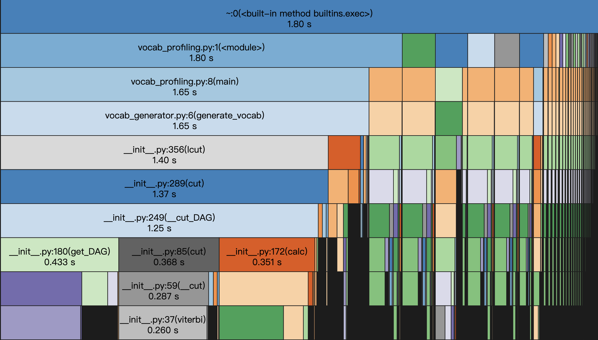

# 一、PSP表格

| **PSP2.1**                              | **Personal Software Process Stages**    | **预估耗时（分钟）** | **实际耗时（分钟）** |
| :-------------------------------------- | --------------------------------------- | -------------------- | -------------------- |
| Planning                                | 计划                                    |        1520             |           1450         |
| · Estimate                              | · 估计这个任务需要多少时间              |         1520             |           1450          |
| Development                             | 开发                                    |       1340               |          1270            |
| · Analysis                              | · 需求分析 (包括学习新技术)             |           120           |              150        |
| · Design Spec                           | · 生成设计文档                          |          60            |                60      |
| · Design Review                         | · 设计复审                              |         30             |               30       |
| · Coding Standard                       | · 代码规范 (为目前的开发制定合适的规范) |              30        |             30         |
| · Design                                | · 具体设计                              |         200      |                150      |
| · Coding                                | · 具体编码                              |         600             |              500        |
| · Code Review                           | · 代码复审                              |          100            |            200          |
| · Test                                  | · 测试（自我测试，修改代码，提交修改）  |             200         |               150       |
| Reporting                               | 报告                                    |         180             |           180           |
| · Test Repor                            | · 测试报告                              |       60               |          60            |
| · Size Measurement                      | · 计算工作量                            |         60             |            60          |
| · Postmortem & Process Improvement Plan | · 事后总结, 并提出过程改进计划          |           60           |              60        |
|                                         | · 合计                                  |        1520              |         1450             |


# 二、任务要求的实现

## 1. 项目设计与技术栈

依题分为以下步骤：
- **数据采集阶段：**
通过爬虫从哔哩哔哩（Bilibili）平台爬取与“大模型”相关的视频及其弹幕数据；
- **数据预处理阶段：**
对弹幕文本进行清洗、分词、过滤；
- **数据统计与可视化展示阶段：**
统计词频并生成词云。
- **数据统计与分析阶段：**
将弹幕转化为文本向量，存储于向量数据库中，结合用户问题通过检索增强问答（RAG）技术生成结论；


使用的主要技术栈如下：

|模块|技术|说明|
|-|-|-|
|爬虫部分	|requests、re、json	|爬取视频弹幕与元数据
|文本处理|	jieba、pandas|	分词与数据清洗
|向量数据库|	langchain_community.vectorstores.Chroma	|存储语义向量用于检索
|检索问答	|langchain、qwen3-max	|构建基于检索增强的智能问答
|数据可视化|	wordcloud	|生成词云
|单元测试|	pytest	|对数据采集与统计模块进行验证


## 2. 爬虫与数据处理

**业务逻辑**

爬虫模块主要由`search`和`barrage`两个类构成。首先通过`search`根据关键词检索到视频，然后不断翻页直至收集到360个视频的bv号。然后再由`barrage`获取视频的cid，从而爬取该视频的所有弹幕。

得到弹幕后，用jieba对其进行分词，然后统计各个分词的词频，接着利用LLM筛选有关AI技术应用的分词，最后再人工筛选。

- 搜索视频
```
class search:
    def __init__(self, keyword="大模型", keep_open=True):
        opts = Options()
        opts.add_argument("--headless")
        self.driver = webdriver.Chrome(
            service=Service(ChromeDriverManager().install()),
            options=opts)
        self.keyword = keyword
        self.__is_started = False
        self.url = f"https://search.bilibili.com/all?keyword={self.keyword}"

    def wait_for_page_load(self, timeout: int = 15, condition=None, poll_frequency: float = 0.5) -> bool:
        if condition is None:
            condition = EC.presence_of_element_located((By.XPATH, "//div[contains(@class, 'video-list')]") )
        try:
            wait = WebDriverWait(self.driver, timeout, poll_frequency=poll_frequency)
            wait.until(lambda d: d.execute_script("return document.readyState") == "complete")
            wait.until(condition)
            return True
        except Exception:
            return False

    @finished("搜索页面已加载")
    def start(self):
        if self.__is_started:
            return
        self.__is_started = True
        self.driver.get(self.url)
        self.wait_for_page_load()

    @finished("已翻到下一页")
    def next_page(self, timeout: int = 10) -> bool:
        try:
            wait = WebDriverWait(self.driver, timeout)
            # 等待下一页按钮可点击
            next_btn = wait.until(EC.element_to_be_clickable((By.XPATH, "//button[text()='下一页']")))
        except TimeoutException:
            return False
        # 在点击前保存对按钮的引用，用于后续等待它变为 stale
        try:
            old_btn = next_btn
            # 确保按钮可见于视窗再点击，减少 click 被拦截的概率
            try:
                self.driver.execute_script("arguments[0].scrollIntoView({block: 'center'});", old_btn)
            except Exception:
                pass
            old_btn.click()
        except Exception:
            # 点击失败
            return False
        # 点击后等待页面更新：优先等待旧按钮变为 stale（被替换或移除），
        # 如果 staleness 超时，则回退等待视频列表元素出现/刷新。
        if self.wait_for_page_load(timeout=15, condition=EC.staleness_of(old_btn)):
            return True
        # 尝试等待视频列表的出现/刷新作为翻页成功的判据
        return self.wait_for_page_load(timeout=15, condition=EC.presence_of_element_located((By.XPATH, "//div[contains(@class, 'video-list')]")))

    def query(self) -> Generator[str, None, None]:
        self.start()
        time.sleep(5)  # 等待页面稳定
        video_list = self.driver.find_element(By.XPATH, "//div[contains(@class, 'video-list')]") # 页面上只有一个包含视频标题的元素，所以使用 find_element
        video_cards = video_list.find_elements(By.CLASS_NAME, "bili-video-card")  # 获取所有视频卡片元素
        print(f"在搜索结果中找到 {len(video_cards)} 个视频:")
        print("-" * 40)
        for card in video_cards:
            # 获取A标签中的href属性
            try:
                a_tag = card.find_element(By.XPATH, ".//a")
                href = a_tag.get_attribute("href")
                if is_valid_url(href):
                    yield href
            except:
                pass
        self.next_page()
        yield from self.query()

    def stop(self):
        try:
            self.driver.quit()
        except Exception:
            pass
```

- 爬取弹幕
```
class barrage:
    def __init__(self, video_url):
        self.video_url = video_url
        self.barrages = {}
        self.cached   = []

    def fetch(self) -> bool:
        # get cid
        try:
            html = requests.get(self.video_url, headers = header)
            html.raise_for_status()
            html_text = html.text
        except:
            return False
        cid_pattern = r'"cid":.(\d+)'
        cid_match = re.search(cid_pattern, html_text)
        if cid_match:
            cid_text = cid_match.group()
        else:
            return False
        cid = re.findall(r'\d+', cid_text)[0]
        # get barrage data
        barrage_url = f'https://comment.bilibili.com/{cid}.xml'
        try:
            barrage_response = requests.get(barrage_url, headers = header)
            barrage_response.raise_for_status()
            barrage_response.encoding = 'utf-8'
            barrage_text = barrage_response.text
            barrage_dict = xmltodict.parse(barrage_text)
            self.barrages = barrage_dict['i']['d']
            return True
        except:
            return False

    def get(self):
        if self.cached:
            return self.cached
        for content in self.barrages:
            try:
                self.cached.append(content['#text'])
            except:
                print(f"弹幕解析出错: {content}; 类型: {type(content)}")
                continue
        return self.cached
```

- 分词
```
def generate_vocab(input_file: str, output_file: str):
    """
    从 JSON 行文件中提取弹幕内容并生成词表

    Args:
        input_file (str): 输入 JSON 行文件路径（每行一个视频的弹幕数据）
        output_file (str): 输出词表文件路径
    """
    all_words = []

    # 1. 按行读取 JSON 文件
    with open(input_file, "r", encoding="utf-8") as f:
        for line_num, line in enumerate(f, start=1):
            line = line.strip()
            if not line:
                continue
            try:
                data = json.loads(line)
                barrages = data.get("barrages", [])
                if not isinstance(barrages, list):
                    continue

                # 2. 对每个弹幕分词并收集结果
                for text in barrages:
                    words = jieba.lcut(text)
                    # 过滤无意义词，只保留中文、英文、数字，长度>1
                    words = [w for w in words if re.match(r'^[\u4e00-\u9fa5a-zA-Z0-9]+$', w) and len(w) > 1]
                    all_words.extend(words)

            except json.JSONDecodeError:
                print(f"第 {line_num} 行不是合法 JSON，已跳过")

    # 3. 统计词频
    word_freq = Counter(all_words)

    # 4. 按词频排序并保存到文件
    with open(output_file, "w", encoding="utf-8") as f:
        for word, freq in word_freq.most_common():
            json_line = json.dumps({"word": word, "frequency": freq}, ensure_ascii=False)
            f.write(json_line + "\n")

    print(f"词表已生成：{output_file}")
    print(f"共统计到 {len(word_freq)} 个不同的词语")
```

## 3. 数据统计接口部分的性能改进

性能分析主要分析生成词表和统计词频这部分。

这里通过cprofile统计各函数所消耗的时间。
```
import cProfile
import pstats
import os
import sys
sys.path.append(os.path.abspath(os.path.join(os.path.dirname(__file__), '..')))
from models.vocab_generator.vocab_generator import generate_vocab

def main():
    # 这里放你要测试的主函数，比如爬虫或数据处理逻辑
    INPUT_FILE = "../datasets/barrage.json"
    OUTPUT_FILE = "../vocabs/barrage_vocab.json"
    generate_vocab(input_file=INPUT_FILE, output_file=OUTPUT_FILE)


# python -m cProfile -o profile.stats vocab_profiling.py
# snakeviz profile.stats
if __name__ == "__main__":
    main()
```
性能分析结果如下:

从中可以发现分词(lcut)是时间消耗最多的地方，消耗了1.40s。
原函数如下:
```
def generate_vocab(input_file: str, output_file: str):
    """
    从 JSON 行文件中提取弹幕内容并生成词表

    Args:
        input_file (str): 输入 JSON 行文件路径（每行一个视频的弹幕数据）
        output_file (str): 输出词表文件路径
    """
    all_words = []

    # 1. 按行读取 JSON 文件
    with open(input_file, "r", encoding="utf-8") as f:
        for line_num, line in enumerate(f, start=1):
            line = line.strip()
            if not line:
                continue
            try:
                data = json.loads(line)
                barrages = data.get("barrages", [])
                if not isinstance(barrages, list):
                    continue

                # 2. 对每个弹幕分词并收集结果
                for text in barrages:
                    words = jieba.lcut(text)
                    # 过滤无意义词，只保留中文、英文、数字，长度>1
                    words = [w for w in words if re.match(r'^[\u4e00-\u9fa5a-zA-Z0-9]+$', w) and len(w) > 1]
                    all_words.extend(words)

            except json.JSONDecodeError:
                print(f"第 {line_num} 行不是合法 JSON，已跳过")

    # 3. 统计词频
    word_freq = Counter(all_words)

    # 4. 按词频排序并保存到文件
    with open(output_file, "w", encoding="utf-8") as f:
        for word, freq in word_freq.most_common():
            json_line = json.dumps({"word": word, "frequency": freq}, ensure_ascii=False)
            f.write(json_line + "\n")

    print(f"词表已生成：{output_file}")
    print(f"共统计到 {len(word_freq)} 个不同的词语")
```

我们在原代码开头加入jieba内置的并行函数进行处理，
```
jieba.enable_parallel(4)
```
得到结果如下

发现lcut消耗时间已经下降至1.18s。


## 4. 数据结论的可靠性

对于数据结论的得出，首先通过将弹幕向量化并存储为知识库，然后检索与问题有关的内容，最后结合大模型得到当前B站用户对于大语言模型技术的主流看法，如应用成本、潜在应用领域、带来的不利影响等。

数据结论及检索到的内容如下:
```
问题: 大语言模型技术的应用成本的主流看法是什么？
retrieve: 语言大模型怎么和你也应用比较？？谁能产生效益？？一目了然
retrieve: 那么问题来了运行，这个大模型所需要的电量耗费和设备折旧是否能弥补这个节省呢？
retrieve: 我本地部署大模型，感觉电费 都不如用API划算，还是满血版
retrieve: 我本地部署大模型，感觉电费 都不如用API划算，还是满血版
retrieve: 这个是语言大模型，另一个是专用大模型，没有可比性
根据提供的弹幕内容，关于大语言模型技术应用成本的主流看法主要包括以下几点：

1. **本地部署成本较高**：有用户反映，本地部署大模型的电费和设备折旧成本较高，甚至“不如用API划算”，而且API版本还是“满血版”（即功能完整、性能更强）。

2. **效益与成本需权衡**：有弹幕质疑运行大模型所耗费的电量和设备损耗是否能被其带来的节省或效益所弥补，体现出对投入产出比的关注。

3. **模型类型影响比较**：有观点指出语言大模型与专用大模型“没有可比性”，暗示不同应用场景下的成本效益分析不能一概而论。

综上，主流看法倾向于认为：**大语言模型的本地部署在电费和硬件损耗方面成本较高，使用云API可能更具性价比，但是否值得投入还需结合具体应用场景和效益评估。**
--------------------------------------------------
问题: 大语言模型技术的潜在应用领域的主流看法是什么
retrieve: 语言大模型怎么和你也应用比较？？谁能产生效益？？一目了然
retrieve: 能落地的应用大模型
retrieve: 大模型是通用的是你定义的？
retrieve: 盘古大模型吧 主要的应用方面是工业智能化
retrieve: 大模型学完能做什么
根据提供的弹幕内容，关于大语言模型技术的潜在应用领域，主流看法包括：

- **能落地的实际应用**：有弹幕强调“能落地的应用大模型”，说明业界关注大模型在现实场景中的实用性。
- **工业智能化**：有提到“盘古大模型吧 主要的应用方面是工业智能化”，表明工业领域是大模型的重要应用方向之一。
- **效益导向**：一条弹幕指出“谁能产生效益？？一目了然”，反映出对大模型是否能带来实际经济效益的关注。

综上，从弹幕内容看，主流看法倾向于关注大语言模型在**可落地、能产生效益**的领域，尤其是**工业智能化**等实际应用场景。
--------------------------------------------------
问题: 大语言模型技术的带来的不利影响有哪些
retrieve: 让全民搞大模型，会不会是自毁长城，太危险了
retrieve: 语言大模型怎么和你也应用比较？？谁能产生效益？？一目了然
retrieve: large language model
retrieve: 语言大模型最多只能用来处理语言信息，无法处理数理逻辑
retrieve: anything llm没准把你数据上传了
根据提供的弹幕内容，大语言模型技术可能带来的不利影响包括：

1. **安全与隐私风险**：有弹幕提到“anything llm没准把你数据上传了”，暗示使用某些大模型工具可能存在用户数据被上传或泄露的风险。

2. **能力局限性带来的误导**：有弹幕指出“语言大模型最多只能用来处理语言信息，无法处理数理逻辑”，说明过度依赖大模型可能在需要严谨逻辑推理的场景中产生错误或误导。

3. **盲目推广的风险**：有弹幕质疑“让全民搞大模型，会不会是自毁长城，太危险了”，表达了对大模型技术被不加区分地广泛推广可能带来负面后果的担忧。

这些观点反映了公众对大语言模型在安全性、适用边界和普及策略方面的顾虑。
--------------------------------------------------
```

## 5. 数据可视化界面的展示

数据可视化部分使用 matplotlib 与 wordcloud 实现，展示了关于人工智能的弹幕词频。
```
import json
from wordcloud import WordCloud
import matplotlib.pyplot as plt

def generate_wordcloud(input_file: str, output_file: str = "wordcloud.png"):
    # 读取词表 
    freq_dict = {}
    with open(input_file, "r", encoding="utf-8") as f:  # 改成你的文件名
        for line in f:
            data = json.loads(line.strip())
            word = data["word"]
            freq = data["frequency"]
            freq_dict[word] = freq

    # 生成词云 
    wordcloud = WordCloud(
        font_path="/System/Library/Fonts/STHeiti Medium.ttc",  # macOS 中文字体
        # Windows 可改为：font_path="C:/Windows/Fonts/simhei.ttf"
        background_color="white",
        width=1000,
        height=600,
        max_words=200,
        colormap="viridis"
    ).generate_from_frequencies(freq_dict)

    # 显示词云
    plt.imshow(wordcloud, interpolation="bilinear")
    plt.axis("off")
    plt.show()

    # 保存为文件
    wordcloud.to_file(output_file)
    print("词云已保存为 wordcloud.png")
```

**LLM、医疗、机器人、量化、芯片、通信、智能驾驶**是当今AI技术的主要应用方面。

